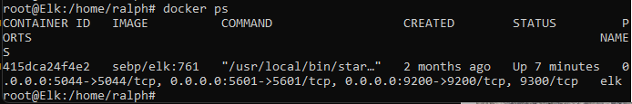

## Automated ELK Stack Deployment

The files in this repository were used to configure the network depicted below.

These files have been tested and used to generate a live ELK deployment on Azure. 
They can be used to either recreate the entire deployment pictured above. Alternatively, 
select portions of the ELK-in-the-Cloud file may be used to install only certain pieces of it, such as Filebeat.

[Filebeat Playbook](./Ansible/ansible.Backup.Before.Roles/filebeat-playbook.yml)

This document contains the following details:
- Description of the Topology
- Access Policies
- ELK Configuration
  - Beats in Use
  - Machines Being Monitored
- How to Use the Ansible Build

### Description of the Topology

The main purpose of this network is to expose a load-balanced and monitored instance of DVWA, the D*mn Vulnerable Web Application.

An Azure load balancer is a Layer-4 (TCP, UDP) load balancer that provides high availability by distributing 
incoming traffic among healthy VMs. A load balancer health probe monitors a given port on each VM and only 
distributes traffic to an operational VM.  The load balancer does not provide any security functionality, as it sits "in front" of the
network security group rules. Only after passing those rules does traffic reach the healthy VMs.

The Jumpbox VM contributes to management of the Azure Resource Group by providing a landing zone for SSH sessions 
from the public network. Only after establishing a connection here, can staff access other VMs in this resource group.
This Jumpbox is also used as an Ansible Control Node. From here, VMs can be configured and fully deployed.

More recently Azure Bastion seeks to offer a similar landing zone for SSH and RDP connections. This should be considered
for future version of this network, if it demonstrates the ability to efficently and securely forward Ansible communications at a lower cost.

Integrating an ELK server allows users to easily monitor the vulnerable VMs for changes to the configuration and system files.

Filebeat is a lightweight shipper for forwarding and centralizing log data. Installed as an agent on your servers, 
Filebeat monitors the log files or locations that you specify, collects log events, and forwards them either to Elasticsearch or Logstash for indexing.

Metricbeat similarly, collects metrics from the operating system and from services running on a server. Metricbeat then forwards them as Filebeat does.

The configuration details of each machine may be found below.
<!-- Note: Use the [Markdown Table Generator](http://www.tablesgenerator.com/markdown_tables) to add/remove values from the table_.
 -->
| Name    | Function                              | Public IP Address | Private IP Address | Operating System |
|---------|---------------------------------------|----------------------|-----------------------|---------------------|
| Jumpbox | Gateway for SSH, Ansible Control   | 20.124.33.137        | 10.0.0.4              | Linux               |
| Web-1   | Web Server                            |                      | 10.0.0.8              | Linux               |
| Web-2   | Web Server                            |                      | 10.0.0.6              | Linux               |
| ELK     | Logging and Monitoring                | 20.112.97.100        | 10.1.0.4              | Linux               |
| Red-Web Load Balancer     | Distribute Web Traffic | 20.124.111.167    | none                  | none                |
### Access Policies

The machines on the internal network are not exposed to the public Internet. 

The Jumpbox machine can accept SSH connections from one specific IP Address on the Internet. It is ONE.SEC.RET.IP.

The Kibana port (:5601) on ELK can be accessed from one specific IP Address on the Internet. This is also ONE.SEC.RET.IP.

The Red-Web Load Balancer HTTP port can be accessed from that same secret IP Address.

Machines within the network can only be accessed by internal users and only from Jumpbox.

A summary of the access policies in place can be found in the table below.

| Name     | "Publicly" Accessible | Allowed IP Addresses |
|----------|---------------------|----------------------|
| JumpBox | (Rule 110) SSH             |  ONE.SEC.RET.IP    |
| Web-1 and Web-2   | (Rule 100) HTTP via load balancer  (Rule 120) SSH | ONE.SEC.RET.IP   JumpBox 10.0.0.4  |
| ELK      | (Rule 200) SSH   (Rule 210) Kibana port:5601/tcp   (Rule 220) Elk ports:5044,5601,9200/tcp | JumpBox 10.0.0.4 ONE.SEC.RET.IP   Web-1 10.0.0.8, Web-2 10.0.0.6 |

### Elk Configuration

Ansible was used to automate configuration of the ELK machine. No configuration was performed manually, which is advantageous because 
YAML files provide smoothly repeatable management and automation of tasks. You won't need to write custom code and Ansible will 
figure out how to get your systems to the state you want them to be in.

The playbook implements the following tasks:
- Use apt to install docker.io and python3-pip
- Use pip to install docker module
- Increase virtual memory
- Download and launch the ELK container with a properly configured firewall
- Enable docker on boot

The following screenshot displays the result of running `docker ps` after successfully configuring the ELK instance.

### Target Machines & Beats
This ELK server is configured to monitor Web-1 and Web-2, using Filebeat and Metricbeat.

These Beats allow us to collect the following information from each machine:
- **Filebeat** monitors logfiles, such as those stored in /var/log/ and /var/log/apache2/. So it would include web logs.
- **Metricbeat** monitors metrics from the system and services. This includes both operating system and application resources and performance. So it would include cpu load and filesystem free space.

### Using the Playbook
To use the playbook, you will need to have an Ansible control node already configured. Assuming you have such a control node provisioned: 

SSH into the control node and follow the steps below:
- Copy the playbook file to /etc/ansible/roles.
- Update the hosts file to include your web server VMs and the Elk server.
- Run the playbook, and navigate to Kibana to check that the installation worked as expected.
- The /etc/ansible/hosts file defines machine types and groupings.
- So, to run the playbook on a specific machine, /etc/ansible/hosts is the file to tweak.
- Or to specify where to install the ELK server, create a new group in that file and add the new server's IP address. 
- Then to check it's working, use a browser to access it. For us that is http://20.112.97.100:5601
